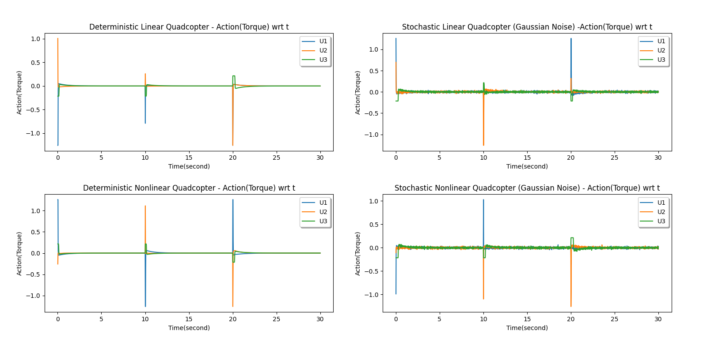

# Quadcopter rotational system dynamics formulation, both nonlinear and linear representations


This study focuses on designing and developing controllers to control angular rates of a quadcopter. Therefore, only the rotational dynamics of the quadcopter are taken into consideration.
Below, you can see the assumptions made before a mathematical model:

* The rotational motion of the quadcopter is independent of its translational motion.
* The center of gravity coincides with the origin of the body-fixed frame.
* The structure of the quadcopter is rigid and symmetrical with the four arms coinciding with the body x- and y-axes.
* Drag and thrust forces are proportional to the square of the propellers speed.
* The propellers are rigid.

## Citing the Project

To cite this repository in publications:

https://arxiv.org/abs/2202.07021

Bibtex:

```bibtex
@article{demirbilek2022quadsim,
  title={QuadSim: A Quadcopter Rotational Dynamics Simulation Framework For Reinforcement Learning Algorithms},
  author={Demirbilek, Burak Han},
  journal={arXiv preprint arXiv:2202.07021},
  year={2022}
}
```

## Mathematical Formulation, Definitions, Dynamics

### Coordinate Frames

Coordinate frames are needed to describe the motions of the quadcopter before the quadcopter is mathematically modeled. Earth Fixed Frame W and Body Fixed Frame B is defined like this:

<p align="center">
  
</p>

The earth-fixed frame is taken as the reference frame using the NED (North East Down) convention where the x-axis of the frame is pointed to the north.

The orientation of the quadcopter, known as attitude is expressed in the body-fixed frame by euler angles phi, theta, psi which corresponds to the roll, pitch and yaw angles.

In order to relate the orientation of the quadcopter in the earth-fixed frame, a rotation matrix is defined. Below, the rotation matrix R is defined, it converts from the body-fixed frame to the earth-fixed frame:


With the rotation matrix, you can calculate the earth-fixed position of any given position.


### Quadcopter body frame formulation

A typical quadcopter is driven by four rotors on the four arms of the frame. The position of the arms according to the body frame can differ. Generally, the most used configurations are "X" and "+" which represents the shape of x and plus shape.

In this study, the "X" shape frame were used and below, you can see the numerated rotors(from 1 to 4), rotation of the numerated rotors(clockwise or counter cw) and the body frame.

<p align="center">
  
</p>

<p align="center">
  
</p>

### From the rotational equations of motion, quadcopter dynamics can be written out as

Let us define the inputs as:


Where,


We can now define the nonlinear system dynamics as:


For both linear and nonlinear systems, below you can find the state and input definitions:


### State space(linear) representation of the quadcopter system

A LTI state space model is written below for model analysis and numerical calculations.


The system was linearized at the hover position and system can fully observable


Where the state vector x and the input vector u is defined like this:


### Nonlinear dynamics


## Simulation

### Solving the ODEs

* To solve the ordinary differential equations, the scipy python package was selected.

* In the scipy library, solve_ivp function with RK45 method(Explicit Runge-Kutta method of order 5(4)) has been used.

* Within the solver parameters, this simulation aimed to have 250Hz simulation step frequency.

Ref: <https://docs.scipy.org/doc/scipy/reference/generated/scipy.integrate.solve_ivp.html#scipy-integrate-solve-ivp>

### Gym Environment

To ease up the usage of the simulation for RL and other agents/algorithms, the simulation has been wrapped up with OpenAI Gym Framework.

#### Environment States and Actions

##### States

   With the given system dynamics, the aim is to track reference angle signals(roll, pitch and yaw angles) in the best way. Therefore, we augment the state with extra 6 dimensional information which tells what reference signals must the controller follow.

   To summarize, the augmented state is defined like this:
   

Note that error variables are the difference between the reference state and current state.

The angle states are also mapped between [-pi, pi).

##### Actions

   The actions are defined as the original definition, the action is a vector with size `(3,)` and it tells the torque/moment vector acting on the quadcopter in the body-fixed frame.

   

   The environment will automatically calculate the propeller speeds with its motor mixing algorithm. So the agent only needs to give the environment the torque vector.

#### Environment Limits(min and max)

   After defining states and actions, the hard limits of these needs to be calculated. These limits needs to be defined in the Gym environment class.

   From the datasheet of the EMAX 650kv dc motors, the maximum speed rating of a dc motor is 4720rpm.
   To calculate the minimum speed rating, we need to calculate the minimum thrust for a quadcopter to hover its weight.


   


   


   Therefore, to achieve the minimum trust, the motor speeds needs to be

   

   

   From the motor min-max speed values, we can calculate the U min and max values:


   


   After that, we can calculate maximum state values when the motor speeds are constant by calculating the definite integral over this period. Please note that rotational values are already bounded, so we dont need to calculate the maximum value of them.

 
   


#### Control Algorithm and Simulation Frequency

   For this simulation, a simulation frequency of __250Hz__ and controller(control algorithm) frequency of __50Hz__ have been selected and used.

   From the openai gym perspective, the action selected from the algorithm will be constant for every 0.02(1/50) seconds.

#### Rewards/Costs

   For the reward function, the quadratic cost of error(reference-current) has been used.


   

   Where Q and R are reward/cost matrices, which are assumed to be normalized identity matrices of shape (6,6) and (3,3) respectively.

   Also, the shape of the current and reference states are (6,1) vectors.

#### Reset Function

   In each reset, reference difference of phi, theta and psi states are randomly generated in range [-pi,pi).
   Because of the current angles are mapped into the range [-pi, pi), the environment also needs to handle the shortest turn angle for some edge cases.

#### Done Condition

   Time is the only designed end condition for this simulation. This is because the simulation states and inputs are bounded for given time, so there is no need for ending the simulation earlier than planned. Parameter `t_start` and `t_end` defines how long each episode will be.

   Because of the implemented systems are time invariant, this time information only defines the episode length of the simulator.

#### Environment Parameters Default Values and Meanings

   The signatures of the environments are given as follow:

   ```python
   DeterministicQuad(solver_func, t_start=0, t_end=5, simulation_freq=250,
                 control_freq=50,
                 dynamics_state=np.array([0, 0, 0, 0, 0, 0]),
                 keep_history=True,
                 random_state_seed=0,
                 set_constant_reference=False,
                 constant_reference=1,
                 set_custom_u_limit=False,
                 custom_u_high=np.array([1, 1, 1])):
   ```

   ```python
   StochasticQuad(solver_func, t_start=0, t_end=3, simulation_freq=250,
                 control_freq=50,
                 dynamics_state=np.array([0, 0, 0, 0, 0, 0]),
                 noise_w_mean=0, noise_w_variance=0.01,
                 noise_v_mean=0, noise_v_variance=0.01,
                 keep_history=True,
                 random_state_seed=0,
                 random_noise_seed_wk=0,
                 random_noise_seed_vk=0,
                 set_constant_reference=False,
                 constant_reference=1,
                 set_custom_u_limit=False,
                 custom_u_high=np.array([1, 1, 1])):
   ```

* __`solver_func`__ is the solver function, which can be `linear_quad_dynamics` or `nonlinear_quad_dynamics` functions. These functions are also defined in the `quad.py` file.

* __`t_start` `t_end`__ are the simulation start and end time. For now, it only affects the episode length because of these systems are time invariant.

* __`simulation_freq`__ is the simulation frequency of the given environment, this parameter only effects the integrator/solver of the environment, not affects the control frequency. It needs to be greater than the `control_freq` parameter.

* __`control_freq`__ is the controller frequency rate which the controller makes actions in each (1/control_freq) timestep. The rate of the gym step() function is only affected by this parameter.

* __`dynamics_state`__ is the initial state of the environment.

* __`noise_w_mean`__ and __`noise_w_variance`__ is the gaussian process noise mean and variance parameter.

* __`noise_v_mean`__ and __`noise_v_variance`__ is the gaussian measurement noise mean and variance parameter.

* __`keep_history`__ parameter enables to keep the state history for this environment from initializing the object to end of the all episodes. All of the history is saved in the object `env.history` if this parameter is true.

* __`random_state_seed`__, __`random_noise_seed_wk`__, __`random_noise_seed_vk`__ is the seed parameter for the random generators. By default these parameters are set to zero.

* __`set_constant_reference`__ and __`constant_reference`__ parameters enables the use of constant reference for the environments. The first parameter is the boolean parameter to enable this functionality and the second parameter is the value of this feature.

* __`set_custom_u_limit`__ and __`custom_u_high`__ parameters enables the use of custom input(U) limits for the system. The first parameter is the boolean parameter to enable this functionality and the second parameter is the value of this feature.

### Quadcopter Simulation Parameters


## Controllers

### PID Control Algorithm

A proportional-integral-derivative(PID) controller is a control loop mechanism for controlling the error signal(difference between the desired setpoint and measured variable) by applying proportional, integral, derivative terms to the system input.

The mathematical form of the overall control function is:


Since PID control algorithm only works for single-input, single-output systems, 3 parallel PID controllers are needed for roll, pitch, yaw angle control.

Matlab-Simulink has been used for auto tune functionality.

Below, the tuned parameters are listed:


### MPC Algorithm

Model predictive control (MPC) is an advanced method of process control that is used to control a process while satisfying a set of constraints. Model predictive controllers rely on dynamic models of the process, most often linear empirical models obtained by system identification.

The main advantage of MPC is the fact that it allows the current timeslot to be optimized, while keeping future timeslots in account. This is achieved by optimizing a finite time-horizon, but only implementing the current timeslot and then optimizing again, repeatedly, thus differing from Linear-Quadratic Regulator (LQR).

Also MPC has the ability to anticipate future events and can take control actions accordingly. PID controllers do not have this predictive ability.

Below, the tuned parameters are listed:


### Infinite Horizon Discrete Linear Quadratic Regulator (LQR)

For Linear Quadratic Gaussian Systems, the dynamics are described as below:


In the complete information case, C is the identity matrix, D is zero and y will be:


For LQR control, Sigma w and Sigma v are also needs to be 0, which means that systems are deterministic.

Also, the matrix Q needs to be positive semi definite(>=0) and the matrix R needs to be positive definite (>0).

#### Regulation task

In the Linear Quadratic Regulator Control (LQR), we can define the optimal feedback policy with given cost function J to regulate the states and inputs to zero.

We can calculate the optimal policy for a finite horizon N with the equations below:


The dimensions of these matrix as follows:


Below, you can see the pseudocode of the LQR algorithm:

```python
def initLQR():
   Define A, B # from the system dynamics
   Define Q, R # from defined cost function
   L = SolveDARE(A, B, Q, R)

# The simulation starts, we can return the jth state with current state
def getLQRActionAtCurrentState(xcurrent):
   uk = -Lk*xcurrent
   return uk
```

#### Tracking task

Until now, the objective was to regulate the state into zero. For the tracking task, we can augment the state as reference minus current state with only one difference, the sign of u. The other formulations are same with the previous formulations.


Below, you can see the pseudocode for LQR with tracking task:

```python
# calculates the LQR gain, same with the regulation problem
def initLQR():
   Define A, B # from the system dynamics
   Define Q, R # from defined cost function
   L = SolveDARE(A, B, Q, R)

# The simulation starts, we can return the jth state with current state
def getLQRActionAtCurrentState(xcurrent):
   xk_bar = xref - xcurrent
   uk = Lk*xk_bar
   return uk
```

##### Selection of Q and R

With the help of the Q and R matrices, we can adjust the tradeoff between the performance and low energy. Having a bigger Q gain than R can make the system to increase the priority on performance while having a bigger R increases the low energy.

For now, the Q and R matrices are defined as below:


##### Solving the riccati equation (Solving DARE)

The Python Control Library has been used for its built-in Riccati Solver.

<https://python-control.readthedocs.io/en/0.9.0/generated/control.lqr.html>

<https://github.com/python-control/Slycot>

## Screenshots

### Open loop-constant input responses

* __No input, U=[0, 0, 0]__

Note: As expected, for the stochastic systems, gaussian process noise make fluctuations in the state although there is no input.

!["Constant input of U=[0, 0, 0]"](images/OL-0_0_0.png "Constant input of U=[0, 0, 0]")

### Feedback Control Examples

* __PID Reference Tracking__

All references and states:


Roll reference and current angle:


Reward Plot(Inverse/Negative of cost):

")

Actions:


* __LQR Reference Tracking__

All references and states:


Roll reference and current angle:


Reward Plot(Inverse/Negative of cost):

")

Actions:



## Installation

### Required python packages
```
conda create -n quadsim python=3.7 -y
conda activate quadsim

conda install pytorch torchvision torchaudio cudatoolkit=11.3 -c pytorch
conda install -c conda-forge gym matplotlib multiprocess slycot control stable-baselines3 tensorboard flake8 casadi libgfortran==3.0.0 -y

pip install do-mpc
```

### Running the tensorboard to observe the learning

`tensorboard --logdir ./logs/quad_tensorboard/`

### Executing the tests

To run the test codes, please execute this command:
```bash
cd quad_rotational_simulation
conda activate quadsim
export LD_LIBRARY_PATH="$LD_LIBRARY_PATH:$(pwd)/src/controllers/hsl/lib"
python tests/unit_tests.py
python tests/test_pid.py
python tests/test_lqr.py
python tests/test_lqg.py
python tests/test_mpc_linear.py
python tests/test_mpc_nonlinear.py
python tests/test_rl_a2c.py
python tests/test_rl_td3.py
python tests/test_rl_ppo.py
python tests/test_rl_ddpg.py
python tests/test_rl_sac.py
```

